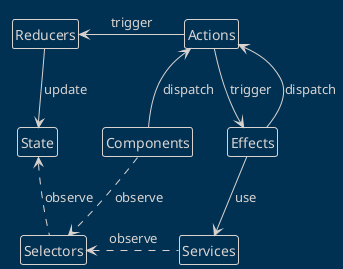

# Todo-list Ionic Demo

This is a mobile application built with Angular and Ionic that helps users manage their to-do list. It uses components, services, routing, and Ionic Native plugins to create a high-quality user experience. The application is designed to work seamlessly on both Android and iOS devices, and follows a mobile-first approach for optimal performance on small screens. 

## Angular-Ionic Overview

The application is built with Angular and Ionic, two popular frameworks for building cross-platform mobile applications with a mobile-first approach. 

### Angular

Angular is a TypeScript-based open-source framework for building web applications. It provides a powerful set of features for building complex user interfaces, handling data, and routing. Angular follows a component-based architecture and uses reactive programming with RxJS for asynchronous operations.

For more information, visit: https://angular.io/

### Ionic

Ionic is a framework for building cross-platform mobile applications using web technologies. It provides a library of UI components, tools, and services for building high-quality mobile apps that can run on both Android and iOS platforms. Ionic provides a suite of plugins for accessing native device features like the camera and storage.

For more information, visit: https://ionicframework.com/

## NgRx Overview

NgRx is an Angular library for managing app state. It uses actions, reducers, selectors, effects, and metareducers for state management.

### Actions

Actions are events for state changes. They have a `type` (description) and an optional `payload` (extra data).

### Reducers

Reducers are functions that update state based on actions. They take the current state and an action as inputs, then return the updated state.

### Selectors

Selectors help access data from the store efficiently. They are functions that take the state as input and return specific data. Selectors use memoization (caching based on input) for better performance.

### Effects

Effects handle asynchronous side effects, like API calls. They listen for actions, perform side effects independently (without waiting), and send (dispatch) new actions to update state.

### MetaReducers

MetaReducers handle synchronous changes to state or actions during development. They address cross-cutting concerns (features affecting multiple parts, like logging or security).

### Example: Todo Feature

The app uses a TodoState for managing the Todo feature:

- **Actions**: Load, add, update, and delete todos.
- **Reducers**: Todo reducer updates state based on actions.
- **Selectors**: Access todo state, todo list, and todo list status.
- **Effects**: Handle asynchronous side effects (e.g., API calls) for todo actions.
- **MetaReducers**: Log actions and state changes during development.

For more on NgRx, visit: https://ngrx.io/docs
